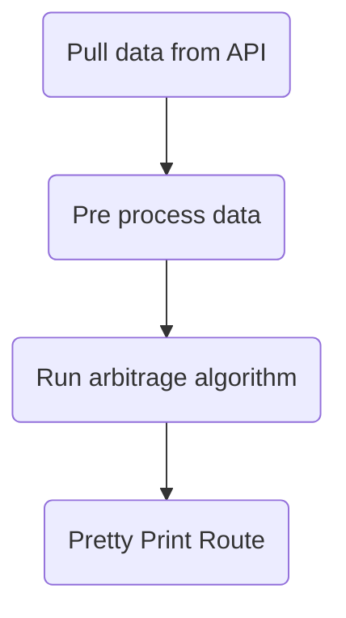

# Arbitrage Loop Algorithm

## Use of negative weight cycles and natural log

The following mathematical equation can be used to look for an arbitrage opportunity:

`r1 * r2 * r3 * ... rn > 1`

where r implies a conversion rate.

Using natural log, the equation above can be used so that it can be used in graph algorithms (i.e. conversion from multiplication to addition):

`r1 * r2 * r3 * ... rn = ln(r1) + ln(r2) + ln(r3) + ... ln(rn) > 1`

The Bellman Ford algorithm can be used to detect negative weight cycles, and therefore using the above algorithm and converting it to the negative, the formula can be used to detect negative weight cycles:

`-ln(r1) + -ln(r2) + -ln(r3) + ... -ln(rn) < 0`

## Software flow diagram

